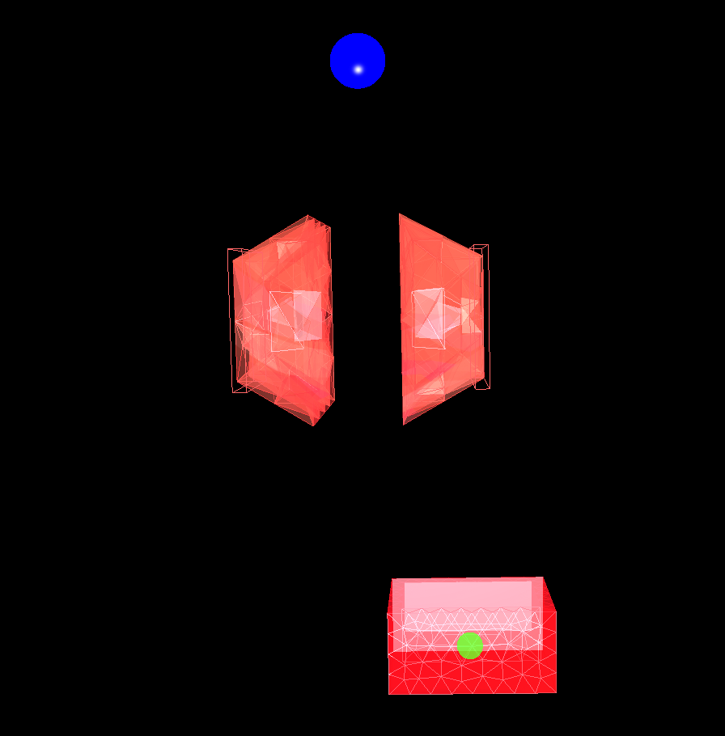

# CatchTheObject
<center>
    


  <table>
    <tr>
      <td><b>Action Space</b></td>
      <td>Box([-1], [1], (1,), float32)</td>
    </tr>
    <tr>
      <td><b>Observation Space</b></td>
      <td>Box([-1]*5, [1]*5, (5,), float32)</td>
    </tr>
    <tr>
      <td><b>Import</b></td>
      <td>gym.make("catchtheobject-v0")</td>
    </tr>
  </table>
</center>


## Description
The aim of this environment is to catch the ball with the cart as it falls from the grasp of a pressure-controlled soft gripper.


## Action Space
The action shape is `(1,)` with a value between `-1` and `1` corresponding to the position of the cart in the x direction.


## Observation Space
The observation is a ndarray with shape `(5,)` with the values between `-1` and `1` corresponding to the y postion and the velocity of the ball, the x position and the movement direction of the cart, and the pressure actuation of the gripper.

<center>
  <table>
    <tr>
      <th>Num</th>
      <th>Observation</th>
      <th>Min</th>
      <th>Max</th>
    </tr>
    <tr>
      <td>0</td>
      <td>Ball Y Position</td>
      <td>-1</td>
      <td>1</td>
    </tr>
    <tr>
      <td>1</td>
      <td>Ball Velocity</td>
      <td>-1</td>
      <td>1</td>
    </tr>
    <tr>
      <td>2</td>
      <td>Cart X Position</td>
      <td>-1</td>
      <td>1</td>
    </tr>
    <tr>
      <td>3</td>
      <td>Cart Movement Direction</td>
      <td>-1</td>
      <td>1</td>
    </tr>
    <tr>
      <td>4</td>
      <td>Gripper Actuation Pressure</td>
      <td>-1</td>
      <td>1</td>
    </tr>
  </table>
</center>


## Rewards
The reward is the negative normalized value of the euclidean distance between the ball and the cart. It has a value between -1 and 0 for each step. The maximum allowed distance used for normalization is set using the env config parameter `max_move`.


## Starting State
The episode starts with the ball falling from above the gripper and the cart is initialized in a random position below the gripper.


## Arguments
This environment currently has no additional arguments.

```python
import gym
import sofagym
from sofagym.envs import *

gym.make('catchtheobject-v0')
```


## Episode End
The episode ends if any one of the following occurs:
- Termination: 
  1. The ball falls or is catched by the cart.
- Truncation (when using the time_limit wrapper):  
  1. The length of the episode reaches the limit specified using the `TimeLimit` wrapper.


## Version History
v0: Initial versions release